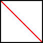

# Implementing the drawSelf Method

We'll also need to provide a method to display or "draw" the clear button on the screen so that the user can see it. Let's first come up with a plan for how it should look, and then implement the `drawSelf` method accordingly.

## The Button Design

Let's have our button look like a white box with a red line crossed through it. Something like this:




The size and position of the button on the screen will be determined by the values assigned to the button's properties. So we'll want to use those variables to position our `rect` and our `line`.

## Follow Along

Let's start by drawing a box at the position described by our properties.

The x and y coordinates of the box are recorded in the `leftX` and `topY` properties. While the width and height of the box are both determined by the `size` property. (Because our button is a square).

Additionally, we'll use the `color` parameter to determine the fill color for the box.

Add this code to the `drawSelf` method:

```java
paint.setLineColor(Color.BLACK);
paint.setFillColor(color);
paint.drawRect(leftX, topY, size, size);
```

## Try it Yourself

Can you figure out how to draw a red diagonal line through the box as shown in the design?

*Use the properties to define the endpoints of the line*.

<details>
  <summary>Solution</summary>
  
```java
paint.setLineColor(Color.RED);
paint.drawLine(leftX, topY + size, leftX + size, topY);
```
</details>
<br>

We'll test this method out in the next step!