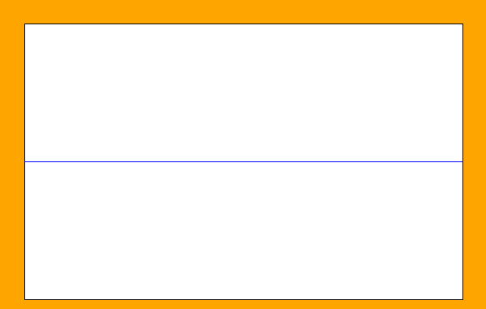

# Drawing Lines

Let's begin by understanding the `drawLine` method. 


When we draw a line, we need to provide two points in space. The first point has its own `x1` and `y1` coordinates and the second point consists of `x2` and `y2`. These points are then connected with our line.

## Follow Along

In the `update()` method, let's draw a line using the following code:

```java
  public void update() {
    paint.setLineColor(Color.BLUE);
    paint.drawLine(0, 0, 600, 400);
  }
```
Here our first point (x1, y1) is set to (0, 0) and our second point (x2, y2) is set to the bottom right corner, (600, 400).

*Notice for lines we use `setLineColor()` rather than `setFillColor()` like we did for shapes.*

## Try It Yourself

Can you change the coordinates of the line so that it stretches horizontally across the middle of the screen like so? How about just the sketchpad area?



<details>
<summary>Click Here for the Solution</summary>

To draw a line across the entire screen we set the y-coordinate of both points to 200, half of the 400 pixel screen height.

The first point will have an x-coordinate of 0 for the left edge of the screen, while the second is at 600, the right edge of the screen.
```java
paint.drawLine(0, 200, 600, 200);
```

If we were to only draw this line inside of the sketchpad, then we need to add 30 pixels to move the left point 30 pixels to the right, and move the right point back 30 pixels to the left:

```java
paint.drawLine(30, 200, 570, 200);
```
</details>
<br>
