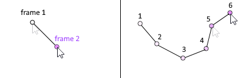

# Creating a Pen Tool

Let's begin by discussing our strategy for how the pen tool should work. We now know how to use the `drawLine()` method to draw a line between two points, and we've seen how the `update()` method rapidly repeats the commands inside of it once per frame.

A pen tool can be thought of like a connect-the-dots drawing. Each frame we'll want to draw a line from *wherever the cursor was last frame* to the *current location of the cursor*:

We can use `mouseInfo.getX()` and `mouseInfo.getY()` to get the current position of the mouse. But we'll have to keep track of the **previous mouse position** ourselves.

In the next step we will see how we can use **variables** to store this data.
