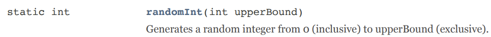

# Random Colors

Let's spice up our program by making the line a random color. For the red, green, and blue value, instead of a raw number, we'll use a random number from 0 to 255. We can use our `Generator` tool to generate random numbers.

Change each value passed to the `setLineColor()` method to a randomly generated number like this:

```java
paint.setLineColor(
  Generator.randomInt(256),
  Generator.randomInt(256),
  Generator.randomInt(256)
);
```

When you run the program you'll notice something interesting.

<details>
<summary>More details, please!</summary>
The `Generator` class has the following documentation:



First thing to notice is the word `static`. You will learn more about this as you dive deeper into programming, but for the moment that means to call this method we need to provide `ClassName.methodName()`, ie: `Generator.randomInt()`. 

Second, this method is expecting an int to be sent in which represents the upperBound. The documentation states whatever number this is will end up generating a random integer from `[0, upperBound)`, not including upperBound. The largest red, green, or blue values are 255. So, we send 256 as our upperBound to receive a number back from 0 to 255.

Third, to the left of the method name is the word `int`, which signifies that when this method finishes running it will return an integer back. This value can be used in any location where integers are expected. The method `setLineColor` is expecting three integers, so instead of typing numbers directly in ourselves we will use the integers that are generating from the `randomInt` call.

There is a lot to process here! Take your time!
</details>

## The Update Method Repeats

Because our update method gets called ~60 times per second, a new line with a new random color gets drawn each frame.
