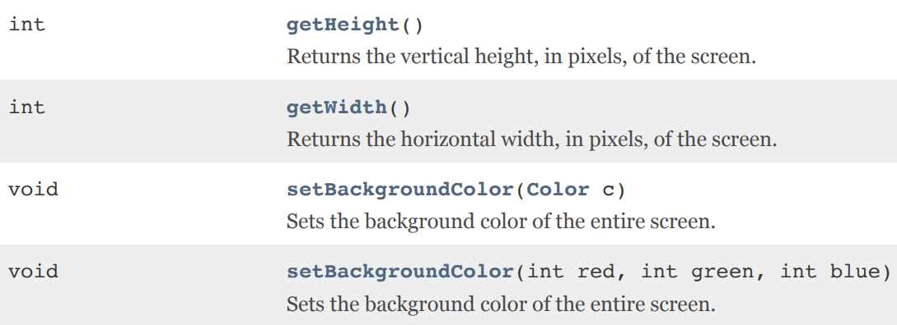
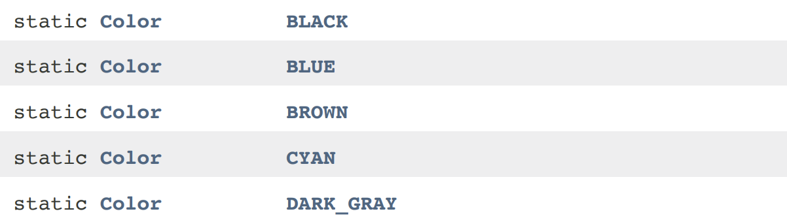

# Reading Documentation

Writing code for a program will always involve using previously created code which could either be directly embedded in the Java language or can be brought in from other sources. The secret to using these other pieces of code is to learn how to read the documentation for each class you will use.

## Documentation

Open the `Screen.pdf` found under the `documentation` folder. This file will provide information of the `Screen` class and indicate what behaviors (methods) the `Screen` already has defined. It will also indicate to programmers how to use these behaviors.

## Methods

Methods are behaviors which can be performed. For instance, a person could perform the behavior of tying their shoe, which has multiple steps to the process. This behavior is used multiple times, so a person memorizes the steps and thinks of the entire process as one action. In Java, this could be simulated by having a method `tieShoe` which could be used multiple times.
  
Looking at the `Screen` documentation, you will see four methods. The names of the methods are `getHeight`, `getWidth`, `setBackgroundColor`, and `setBackgroundColor` again. Inside the `()` you will see what information needs to be provided.  

  
The `getHeight()` and `getWidth()` parenthesis are empty, which means no information is needed to be provided. The two `setBackgroundColor(Color c)` and `setBackgroundColor(int red, int green, int blue)` methods require information to be passed in.

## Fields

Fields represent named values. For instance, a person may have a field representing their age or their name while a digital calculator may have a field representing the value of PI.

Look at the `Color.pdf` under the `documentation` folder. You will see the `Color` class has many fields representing the names of specific color values like `BLACK`, `MAGENTA`, and others.

 More on Method Headers

A method's documentation will identify information about what a method does, whats its name is, what information needs to be provided, and what kind of answer the method will generate. 

* The name will be used when calling the method.
* The values written inside the `(parenthesis)` indicates which information, if any, needs to be provided to call this method. The correct number and types of information must be provided when calling the method.
* The type of value the method returns will be indicated before the method name. Some methods do not return a value and have a return type of `void`, while others will return a value and indicate the type of information which will be received after this method finishes.

 More on Fields

Some classes will have fields which represent values which are able to be used anywhere. The `Color` class has `public static` fields. You can access public static values by typing in `ClassName.FIELD_NAME`, for instance `Color.CYAN` or `Color.RED`. Unlike a method, a field will not have `()` following it.

As you move further into your programming journey you will learn more about the words `public` and `static`.

 
