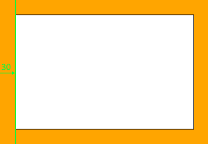
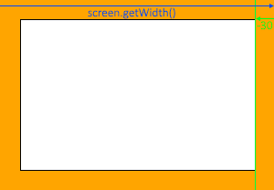
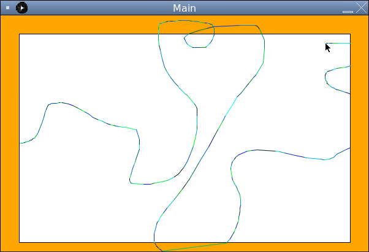

# Only Draw Inside the Sketchpad

Java doesn't really understand anything besides mathematical logic, and so we can't explain to it what we want our condition to be in any other way. Previously we were lucky that our library had a method `mouseInfo.isMouseDragged` we could use, but there is no `mouseInfo.isWithinSketchpad` or anything we can use.

Instead we'll need to think mathematically, what does it mean for the mouse to be within the sketchpad area.

Consider this diagram. If the mouse is in the sketchpad, then we know it's x-coordinate must be larger than the x-coordinate of the left sketchpad border:



Additionally, the mouse must be to the right (smaller than) of the right sketchpad border.



We can write these conditions as:
1. `mouseInfo.getX() > 30` (The border around the sketchpad is 30 pixels wide)
2. `mouseInfo.getX() < screen.getWidth() - 30`

## Adding Multiple Conditions to our Code

Use `&&` operators to add these two conditions to our if-statement like so:

```java
//+ Add two conditions in the if-statement
if (mouseInfo.isMouseDragged() &&
    mouseInfo.getX() >= 30 &&
    mouseInfo.getX() <= screen.getWidth() - 30) {

    paint.drawLine(mouseInfo.getX(), mouseInfo.getY(), lastMouseX, lastMouseY);

    lastMouseX = mouseInfo.getX();
    lastMouseY = mouseInfo.getY();
}
```

## Run the Program

We should now see that we can only draw lines within the left and right borders of our sketchpad. But we can still draw above and below the pad...


