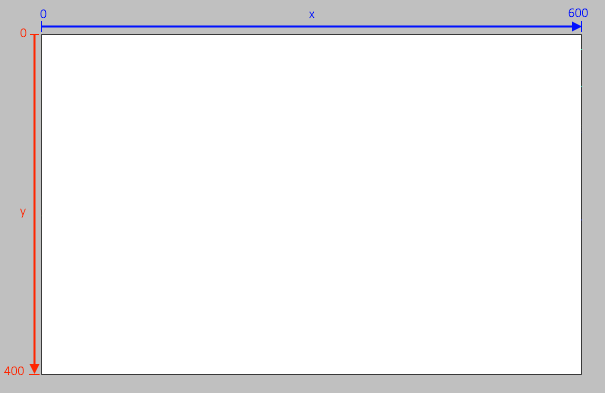
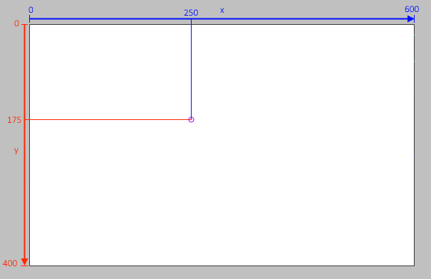
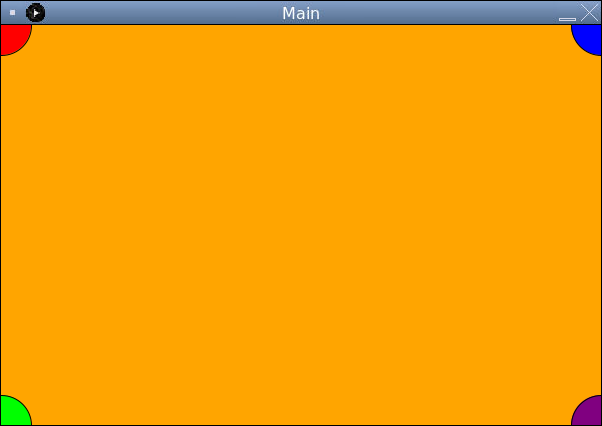

# Drawing Shapes

Let's practice drawing some shapes to the screen. We can draw circles using the `Paint` class. Look at the documentation to find the correct method we will be using to draw a circle. Notice we need to provide the `x` and `y` coordinates and a `radius`.

Our canvas is 600 pixels wide and 400 pixels tall. (*You may need to adjust your output window size to see it fully*).

The `x-axis` runs from **left to right**, whereas the y-axis runs from **top to bottom**:



For example, here is the point `(250, 175)`



## Draw a Circle in the Top-left Corner

Let's place a circle at position `(0,0)` with a radius of `30` pixels:

At the bottom of the `initialLaunch()` method add:

```java
paint.setFillColor(Color.RED);
paint.drawCircle(0, 0, 30);
```

Run the program and you should see a red circle in the top left of the output window.

## Try It Yourself

Add a blue circle to the top right corner by calling `paint.setFillColor(Color.BLUE)` and `paint.drawCircle(600, 0, 30)`.

Then add a Green and a Purple Circle to the bottom left and bottom right corner. It should look like this if you've done it correctly:



<details>
<summary>How does this method work?</summary>

### Drawing the Circle

We are using the `drawCircle` method of the `PaintingTool` class. Notice that at the top of the `Sketchpad` class we are creating some tools (more on this when we get to **variables** and **classes**)

```java
private final Screen screen = new Screen();
private final MouseInfo mouseInfo = new MouseInfo();
private final PaintingTool paint = new PaintingTool();
```

Our `PaintingTool` is called `paint` so when we want to use a `PaintingTool` method, we need to start with `paint.` followed by the name of the method we wish to use. In this case `drawCircle`.

### Setting the Color

In Processing, setting a color is like changing the color on a paintbrush. Once we've set the fill color, everything drawn will be in that color until we call `setFillColor` again.

</details>
<br>