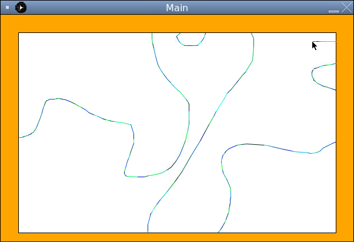

# Try it Yourself

Using similar logic to how we constrained our drawing between the left and right edges of the sketchpad, can you add two more conditions to prevent drawing above and below the top and bottom of the sketchpad?

Try it yourself here and proceed to the next lesson to see the solution if you need.

## In the next lesson

We'll next learn a new very powerful control structure called loops. Loops can save us a ton of time and prevent redundant code. In understanding these structures, you'll really begin to unlock the power of programming!

## Check Out BloomTech

You're on a roll! Keep that momentum going by diving deeper into Java. Check out <a href="https://www.bloomtech.com/java">BloomTech's Backend Development course</a>, where we'll teach you the backend development skills employers want—then help you land a great job.