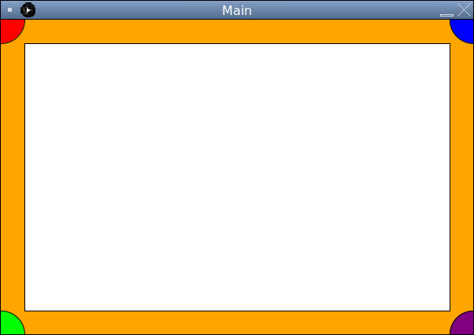

# Create Our Sketchpad

Next let's draw a large white rectangle in the center of our screen. This will represent our sketchpad for the drawing program we'll be creating in this course.

First look at the documentation for the `drawRectangle` method in the `PaintingTool.pdf` file. The rectangle function works by providing an `x` and a `y` coordinate for the top-left corner, followed by a `width` and a `height`.

## Follow Along

Add this call to the `Paint` class method `drawRect()` to the bottom of the DrawingBoard's `initialLaunch()` method:

```java
paint.setFillColor(Color.WHITE);
paint.drawRect(30, 30, 540, 340);
```

This way we have a white sketchpad area with a margin of 30 pixels all around it.



<details>
<summary>Where did these numbers come from?</summary>

We've decided on a margin of 30 pixels around our sketchpad so that we have some space for UI (user-interface) elements later.

First we provide the `x` and `y` coordinates for the top left corner of our rectangle, (30, 30). Thirty pixels from the left of the canvas and thirty pixels down from the top of the canvas.

Next we must provide the `width` and `height` of the rectangle. Our `Screen` is 600 pixels wide, and we subtract 30 pixels for the left margin, and 30 again for the right margin. 600 - 30 - 30 = 540 pixels wide.

Since our `Screen` is 400 pixels tall, 400 - 30 - 30 = 340 for the height of our rectangle.

</details>
<br>
