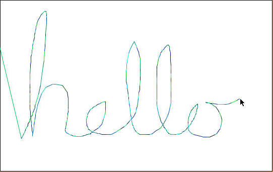

# Finishing the Pen

If you run the program, you should now see that you can draw lines across the canvas by moving your mouse.

What we'd like to do next is add some **conditions** to our pen behavior. It should only draw when we hold left-click and drag the mouse, and it should only draw lines within the white sketchpad area.

In the next lesson we will learn to write `if-statements` and use **boolean logic** to define and enforce conditions.

## Check Out BloomTech

You're on a roll! Keep that momentum going by diving deeper into Java. Check out <a href="https://www.bloomtech.com/java">BloomTech's Backend Development course</a>, where we'll teach you the backend development skills employers want—then help you land a great job.