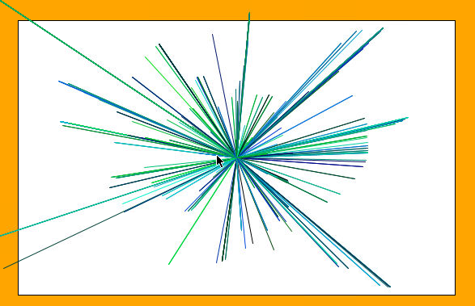

# The Finished Starburst

Run the program and move your mouse in a circle around the center of the canvas. You should see something like this:

## Try It Yourself

Try changing the color values to only use blue and green values, while red is always zero. (Or any other combination you may like):

## Check Out BloomTech

Having fun?! Get even more with BloomTech's <a href='bloomtech.com/java'>Backend Development course</a>. You can start for free!
