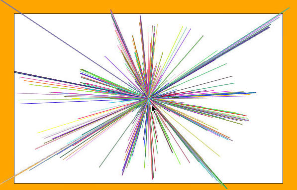

# The Completed Sketchpad

That's it for our first lesson! We now have a nice white space on our screen where we'll soon be able to draw in with our mouse.

In the next lesson, we will learn about the `update` method and how we can make our program **interactive** by drawing lines towards our mouse!

## Concepts

In this lesson, we learned to call and pass data to methods. And we saw how a library like Processing can give us a some predefined methods that we can call right from the start.

## Check Out BloomTech

Like what you're learning? Develop even more Java skills and get trained for a great backend development job with BloomTech. Visit <a href="https://www.bloomtech.com/java">bloomtech.com/java</a>